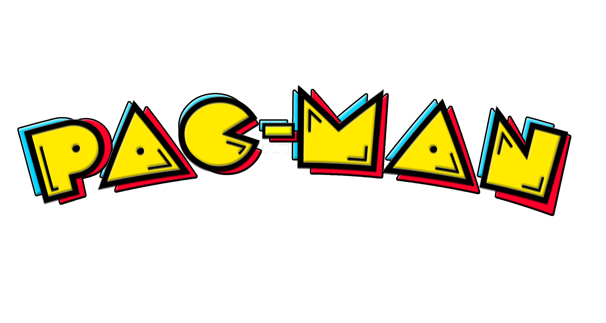

# 🎮 Pacman Game



## 📝 Description

This is a classic Pacman game developed with vanilla JavaScript, HTML5, and CSS3. The goal is to control Pacman to eat all the dots in the maze while avoiding the ghosts. The game features classic elements such as:

- Pacman movement in 4 directions
- Ghosts with artificial intelligence that chase the player
- Scoring system
- Lives system (3 lives)
- Teleportation through side tunnels
- Start, game over, and victory screens

## 🚀 How to Play

1. Clone the repository:
   ```
   git clone https://github.com/camilasena/pacman-game.git
   ```
2. Open the `index.html` file in your browser
3. Click "PLAY" to start the game
4. Use the arrow keys (↑, ↓, ←, →) or (W,S,A,D) to control Pacman

## 🎯 Game Objective

The objective of the game is to eat all the dots in the maze without being caught by the ghosts. You have 3 lives, and you lose one each time a ghost catches you. The game ends when you lose all your lives or eat all the dots.

## 🔧 Technologies Used

- HTML5
- CSS3
- JavaScript (Vanilla)
- Canvas for rendering

## 🧩 Project Structure

```
pacman-game/
│
├── assets/                # Game images and resources
│   ├── animations.gif     # Pacman animation sprites
│   ├── ghost.png          # Ghost sprites
│   ├── logo.png           # Game logo
│   └── favicon.png        # Page icon
│
├── js/                    # JavaScript code
│   ├── game.js            # Main game logic
│   ├── pacman.js          # Pacman class and logic
│   └── ghost.js           # Ghost class and logic
│
├── style/                 # CSS files
│   └── style.css          # Game styles
│
├── index.html             # Main HTML file
└── README.md              # This file
```

## 🕹️ Game Features

- **Maze**: Classic Pacman map with walls and paths
- **Pacman**: Animation with movement in 4 directions
- **Ghosts**: AI that alternates between chasing and random movements
- **Scoring System**: Earn points by eating dots
- **Lives**: 3 lives per game
- **Teleportation**: Tunnels that allow crossing through the map
- **Responsive Design**: Retro visuals with modern touches

## 👩‍💻 Developed by

[Camila Sena](https://github.com/camilasena-a)

## 📜 License

This project is under open source license. Feel free to use, modify, and distribute as needed.

---

Have fun playing and feel free to contribute with improvements! 🎮👾
